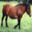

# Assignment 4

This assignment is done in order to fulfil the course requirements of AV493 - Machine Learning for Signal Processing.
The resources may be used only for educational and research purposes

## Objectives

* To understand the train/val/test splits and the use of validation data for hyperparameter tuning-  
* To implement and apply a k-Nearest Neighbor (kNN) classifier
* To implement and apply a Multiclass Support Vector Machine (SVM) classifier
* To implement and apply a Softmax classifier
* To implement and apply a Two layer neural network classifier
* To understand the differences and tradeoffs between these classifiers

## Approach

The code has been done in Jupyter notebook, and the solutions have beeen filled in the appropriate places,
with appropriate comments for anyone reading to understand.

## File distribution

Due to multiple problems, with pickle we have converted CIFAR-10 Dataset to a friendly approach, where we have
extracted the data in the arrays to pictures stored in train and test folders, also we have reconstructed data into
more meaningful extraction.

Data is stored in a pickle file consisting of a dictionary, which has the following architecture for extraction and can be used
anywhere,

```
import pickle

with open('data.pickle','rb') as f:
    data = pickle.load(f)

Xtrain = data['Xtrain']
Ytrain = data['Ytrain']
Xtest = data['Xtest']
Ytest = data['Ytest']
```

These are what the following variables represent:-

* `Xtrain` - list of 50,000 - 1x3072 array consisting linearly stored images cascaded bandwise
* `Ytrain` - list of 50,000 - labels corresponding to each array in `Xtrain` at same index
* `Xtest` - list of 10,000 - 1x3072 array consisting linearly stored images cascaded bandwise
* `Ytest` - list of 10,000 - labels corresponding to each array in `Xtest` at same index

A few sample images are shown from the data set as:



Horse


Ship

## File descriptions

* k-Nearest Neighbor classifier - The IPython Notebook knn.ipynb will walk you through implementing the kNN classifier.

* Training a Support Vector Machine - The IPython Notebook svm.ipynb will walk you through implementing the SVM classifier.

* Implementing a Softmax classifier - The IPython Notebook softmax.ipynb will walk you through implementing the Softmax classifier.

* Two-Layer Neural Network - The IPython Notebook two_layer_net.ipynb will walk you through the implementation of a two-layer neural network classifier.

## Results + How to

Note: Keep the CIFAR10 dataset in the same folder under the folder name `cifar`

CIFAR10 dataset cannot be uploaded owing to its large file size

Run in the following order:

* `data_storage.py` - Run only if you have the cifar-10 dataset in the same folder under the folder name `cifar`
* `train_image_generator.py`
* `test_image_generator.py`
* `Nearest_Neighbour.py`
* `k_nn.py`
* `tweak_hyperparameter.py`
* `features.ipynb`
* `knn.ipynb`
* `svm.ipynb`
* `softmax.ipynb`
* `two_layer_net.ipynb`

Run the codes, to get the results!

## Conclusion

The project has taught me the true aspect of implementation, and now we can easily apply the concepts of Machine Learning to 
real world problems. CIFAR-10 is a comprehensive dataset covering 10 classes with 60,000 images of 32x32 pixel size. This dataset can be also used 
for training any other classifier or more importantly detetctors with the help of CNN.